#Responsable Jose Ángel Rojas
## Operadores
### Operadores Aritméticos
#### **Operador:** +

**Tipo:** Aritmético	

**Interfaz:** SQL 

**Implementación:** (C)

**Synopsis:**	
```
     Intervalo  +  Intervalo
```

**Descripción:** + Define la operación aritmética adición de intervalos

**Ejemplo:** 
```sql
      select intervalo(e_inc_num) + intervalo(e_mort_tbhiv_num_hi) as sumaIntervalo from tuberculosis
```
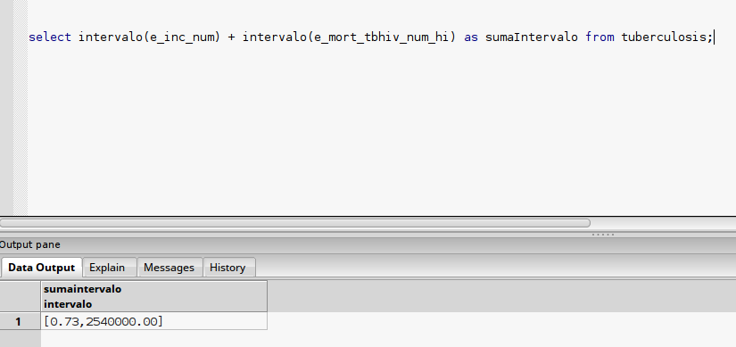

***

###**Operador:** -

**Tipo:** Aritmético	

**Interfaz:** SQL 

**Implementación:** (C)


**Synopsis:** 
```
     Intervalo  -  Intervalo
```
**Descripción:** - Define la operación aritmética resta de intervalos

**Ejemplo:** 
```sql
      select intervalo(e_inc_num) - intervalo(e_mort_tbhiv_num_hi) as restaIntervalo from tuberculosis
```
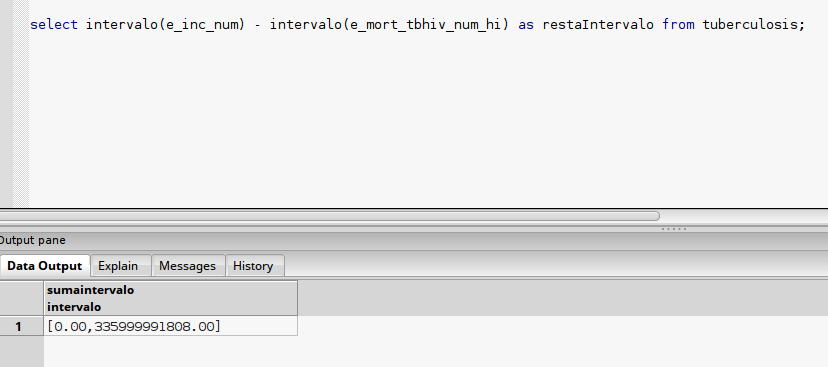	 

- - -

###**Operador:** *

**Tipo:** Aritmético	

**Interfaz:** SQL 

**Implementación:**  (C)


**Synopsis:** 
```
     Intervalo  *  Intervalo
```
**Descripción:** * Define la operación aritmética producto de intervalos

**Ejemplo:** 
```sql
      select intervalo(e_inc_num) * intervalo(e_mort_tbhiv_num_hi) as productoIntervalo from tuberculosis
```
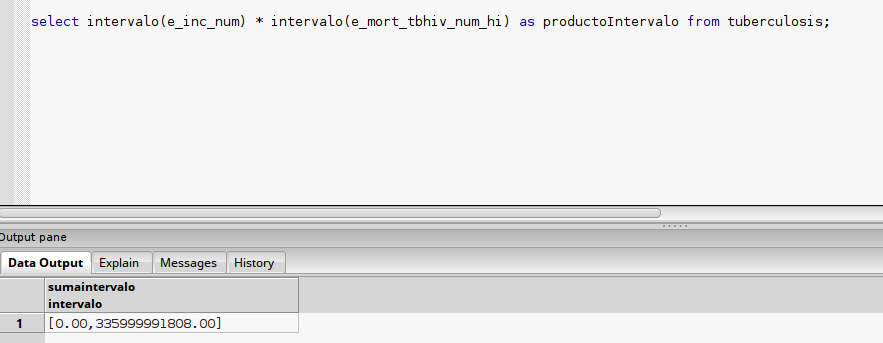

- - -

###**Operador:** /

**Tipo:** Aritmético	

**Interfaz:** SQL 

**Implementación:** (C)


**Synopsis:** 
```
     Intervalo  /  Intervalo
```
**Descripción:** / Define la operación aritmética cociente de intervalos

**Ejemplo:** 

```sql
      select intervalo(e_inc_num) / intervalo(e_mort_tbhiv_num_hi) as cocienteIntervalo from tuberculosis
```
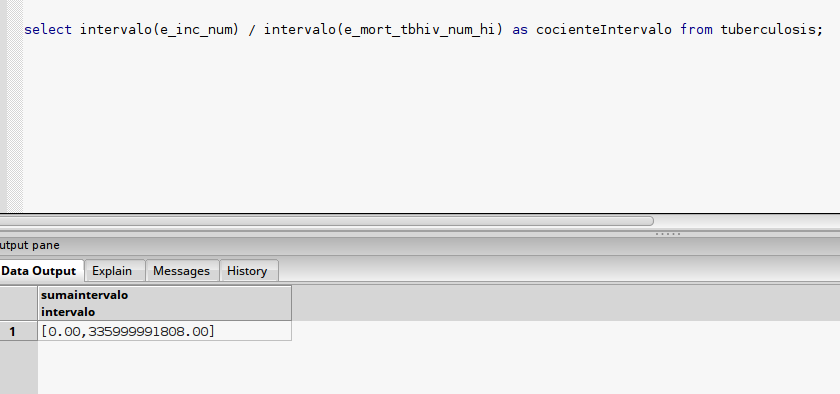

---

###**Operador:**  #'

**Tipo:** Aritmético	

**Interfaz:** SQL 

**Implementación:** (C)


**Synopsis:** 

**Descripción:** # Define la operación aritmética inversa de intervalos

**Ejemplo:** 
```sql
      select intervalo(e_inc_num) # from tuberculosis
```
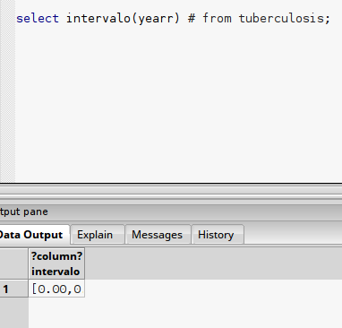


* * * 
* * * 

###   Operdadores Lógicos

###**Operador:**  <

**Tipo:** Relacional	

**Interfaz:** SQL 

**Implementación:** C


**Synopsis:** 
```
     Intervalo  < Intervalo
```
**Descripción:** - Define la operación relacional menor que de intervalos

**Ejemplo:** 
```sql
      select intervalo(e_inc_num) < intervalo(e_mort_tbhiv_num_hi) from tuberculosis
```
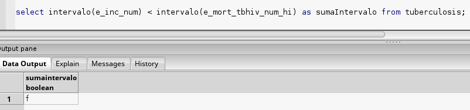

* * *

###**Operador:**  >

**Tipo:** Relacional	

**Interfaz:** SQL 

**Implementación:** C


**Synopsis:** 
```
     Intervalo  > Intervalo
```
**Descripción:** - Define la operación relacional mayor que de intervalos

**Ejemplo:** 
```sql
      select intervalo(e_mort_tbhiv_num_hi) > intervalo(e_inc_num) from tuberculosis
```
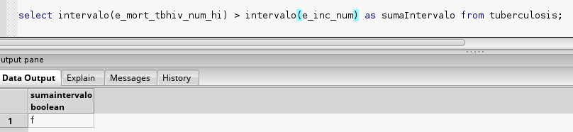

* * *

###**Operador:**  <=

**Tipo:** Relacional	

**Interfaz:** SQL 

**Implementación:** C


**Synopsis:** 
```
   Intervalo  <= Intervalo
```
**Descripción:** - Define la operación relacional menor o igual que de intervalos

**Ejemplo:** 
```sql
      select intervalo(e_inc_num) <= intervalo(e_mort_tbhiv_num_hi) from tuberculosis
```
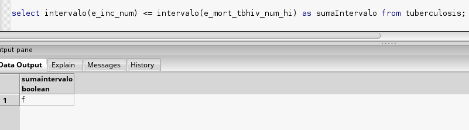

* * *

###**Operador:**  >=

**Tipo:** Relacional	

**Interfaz:** SQL 

**Implementación:** C


**Synopsis:** 
```
     Intervalo  >= Intervalo
```
**Descripción:** - Define la operación relacional mayor o igual que de intervalos

**Ejemplo:** 
```sql
      select intervalo(e_mort_tbhiv_num_hi) >= intervalo(e_inc_num) from tuberculosis
```
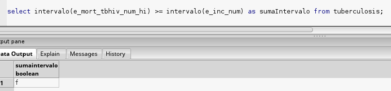

* * *

###**Operador:**  ==

**Tipo:** Relacional	

**Interfaz:** SQL 

**Implementación:** C


**Synopsis:** 
```
     Intervalo  == Intervalo
```
**Descripción:** - Define la operación relacional iguales de intervalos

**Ejemplo:** 
```sql
      select intervalo(e_inc_num) == intervalo(e_mort_tbhiv_num_hi) from tuberculosis
```
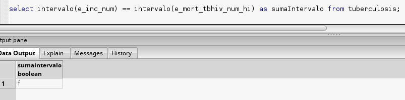

* * *

###**Operador:**  <>

**Tipo:** Relacional	

**Interfaz:** SQL 

**Implementación:** C


**Synopsis:** 
```
     Intervalo  <> Intervalo
```
**Descripción:** - Define la operación relacional iguales de intervalos

**Ejemplo:** 
```sql
      select intervalo(e_inc_num) <> intervalo(e_mort_tbhiv_num_hi) from tuberculosis
```
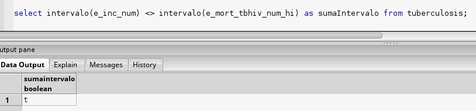

* * *


