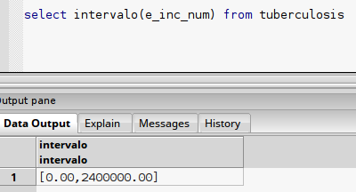
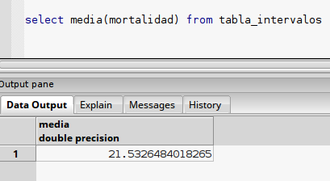
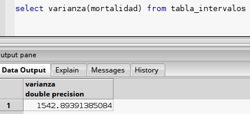

#Se detallarán las funciones interfaz y de linkeo de PostgreSQL con C

##Extensión Intervalo

##Funciones de Interfaz

###**Función:** Entrada

**Interfaz:** SQL
```sql
	create or replace function intervalo_in(cstring)
	returns intervalo
	as '/opt/PostgreSQL/9.4/lib/intervalo.so','intervalo_in'
	language c immutable strict;
```

**Implementación:** (C)
```c
	intervalo *intervalo_in(char *str)
	{
		float8 mini; 
		float8 maxi; 
		intervalo* interv;
		interv = (intervalo*) palloc(sizeof(intervalo));
		sscanf(str, "[%lf,%lf]", &mini, &maxi);
		interv->min = mini;
		interv->max = maxi;
		return (interv);    
	}
```

**Synopsis:**	
```
	insert into nombre_tabla values ([número,número])
```

**Descripción:** Esta función es para insertar intervalos.

**Parámetros:**

**+Entrada:** 		
str – variable que trae los valores que iran en el intervalo.

**-Salida:**	
interv – variable de retorno de tipo intervalo, creado con los valores de str.

**Ejemplo:**
```sql
  insert into tabla x values([2,3]);
```

* * * 

###**Función:** Salida

**Interfaz:** SQL
```sql
	create or replace function intervalo_out(intervalo)
	returns cstring
	as '/opt/PostgreSQL/9.4/lib/intervalo.so','intervalo_out'
	language c immutable strict;
```

**Implementación:** (C)
```c
	char *intervalo_out(intervalo *in)
	{
		char *result=(char*)malloc(20);	
		sprintf(result,"[%.2f,%.2f]",in->min,in->max);
		return result;
	}
```

**Synopsis:**	
```
	select columna_intervalo from nombre_tabla;
```

**Descripción:** Esta función es para mostrar intervalos.

**Parámetros:**

**+Entrada:** 		
in – variable tipo intervalo, contiene el intervalo que se quiere mostrar.

**-Salida:**	
result – variable de retorno de tipo char*, contiene la forma en la que se mostrará el intervalo in.

**Ejemplo:**
```sql
  select colint from x;
```

* * * 
* * *

##Funciones Estadísticas 

###**Función:** Intervalo

**Interfaz:** SQL
```sql
	create or replace function estado_inicial(float8[], float8) 
	returns float8[]
	as '/opt/PostgreSQL/9.4/lib/intervalo.so','Intervalo_init'
	language c immutable strict;

	create or replace function estado_final(float8[])
	returns intervalo
	as '/opt/PostgreSQL/9.4/lib/intervalo.so','Intervalo_final'
	language c immutable strict;

	create aggregate intervalo(float)
	(
	  sfunc=estado_inicial,
	  stype=float8[],
	  finalfunc=estado_final,
	  initcond = '{}'
	);
```

**Implementación:** (C)
```c
	PG_FUNCTION_INFO_V1(Intervalo_init);
	Datum Intervalo_init(PG_FUNCTION_ARGS)
	{
	    ArrayType *input;
	    float8 nuevo;
	    Datum *new;
	    Datum *aux;
	    ArrayType *output;
	    Oid intype,ntype;
	    bool i_typbyval;
	    char i_typalign;
	    int16 i_typlen;
	    int i,n;
	 
	    if(PG_ARGISNULL(0)||PG_ARGISNULL(1))
	    PG_RETURN_NULL();  
	 
	    input=PG_GETARG_ARRAYTYPE_P(0);
	    intype=input->elemtype;
	    get_typlenbyvalalign(intype, &i_typlen, &i_typbyval, &i_typalign);
	    ntype=get_fn_expr_argtype(fcinfo->flinfo, 1);
	     
	    if(intype==FLOAT8OID&&ntype==FLOAT8OID)
	    {        
	        deconstruct_array(input,intype,i_typlen,i_typbyval,i_typalign,&aux,NULL,&n);    
	        n++;
	        new=(Datum*)repalloc(aux,n * sizeof(Datum));
	        nuevo=PG_GETARG_FLOAT8(1);
	        new[n-1]=Float8GetDatum(nuevo);
	        output = construct_array((void *)new,n, intype, i_typlen, i_typbyval, i_typalign);
	        pfree(new);
		
	        PG_RETURN_ARRAYTYPE_P(output);
	 
	    }else{
	        elog(ERROR,"Invalid input data type");
	        PG_RETURN_NULL();
	    }
	}
	 
	PG_FUNCTION_INFO_V1(Intervalo_final);
	Datum Intervalo_final(PG_FUNCTION_ARGS)
	{
	    ArrayType *input;
	    float8 min;
	    float8 max;
	    Datum *iterador;
	    bool *nulls;
	    bool i_typbyval;
	    char   i_typalign;
	    int16  i_typlen;
	    int i,n;
	    intervalo *resultado;
	     
	     if (PG_ARGISNULL(0)){
	       PG_RETURN_NULL();
	       
	    }
	    input=PG_GETARG_ARRAYTYPE_P(0);
	    Oid  intype;
	    intype=ARR_ELEMTYPE(input);
	    get_typlenbyvalalign(intype, &i_typlen, &i_typbyval, &i_typalign);
	    
	    if(OidIsValid(intype)&&intype==FLOAT8OID)
	    { 
	      deconstruct_array(input, intype, i_typlen, i_typbyval, i_typalign,&iterador, &nulls, &n);
	      resultado=(intervalo*)palloc(sizeof(intervalo));
	      max=min=DatumGetFloat8(iterador[0]);
	      
	      for(i=1;i<n;i++)
	      {
		if(max<DatumGetFloat8(iterador[i]))
	        max=DatumGetFloat8(iterador[i]);
	        
		if(min>DatumGetFloat8(iterador[i]))
	        min=DatumGetFloat8(iterador[i]); 
		
	      }
	      resultado->min=min;
	      resultado->max=max;
	      pfree(iterador);
	      pfree(nulls);
	      
	      PG_RETURN_POINTER(resultado);     
	      
	    }else{
	      elog(ERROR, "Invalid input data type");
	      PG_RETURN_NULL();
	      
	    }
	}
```

**Synopsis:**	
```
intervalo (columna_tabla)
```

**Descripción:** Define un intervalo a partir de una columna de una tabla de la base de datos. 
	             El tipo de datos de la columna seleccionada debe ser de tipo flotante, doble precisión o entero.

**Parámetros:**

**+Entrada:** 		
PG_FUNCTION_ARGS – variable que se selecciona de una tabla de datos, para convertirla en una variable intervalo

**-Salida:**	
intervalo – variable de retorno de tipo intervalo, que muestra los valores mínimo y máximo presente en variable_entrada

**Ejemplo:**
```sql
  select intervalo(e_inc_num) from tuberculosis
```

* * * 

###**Función:** Media Muestral

**Interfaz:** SQL
```sql
	create or replace function media_inicial(float8[], intervalo)
	returns float8[]
	as '/opt/PostgreSQL/9.4/lib/intervalo.so','media_inicial'
	language c immutable strict;

	create or replace function media_final(float8[])
	returns float8
	as '/opt/PostgreSQL/9.4/lib/intervalo.so','media_final'
	language c immutable strict;

	create aggregate media(intervalo)
	(
	  sfunc=media_inicial,
	  stype=float8[],
	  finalfunc=media_final,
	  initcond = '{0}'
	);
```

**Implementación:** (C)
```c
	PG_FUNCTION_INFO_V1(media_inicial);
	Datum media_inicial(PG_FUNCTION_ARGS)
	{
	    ArrayType *input;
	    intervalo *nuevo;
	    Datum *new;
	    Datum *aux;
	    ArrayType *output;
	    Oid intype,ntype;
	    bool i_typbyval;
	    char i_typalign;
	    int16 i_typlen;
	    int i,n;
	    float8 centro;
	 
	    if(PG_ARGISNULL(0)||PG_ARGISNULL(1))
	    	PG_RETURN_NULL();  
	 
	    	input = PG_GETARG_ARRAYTYPE_P(0);
	    	intype = input->elemtype;
	    	get_typlenbyvalalign(intype, &i_typlen, &i_typbyval, &i_typalign);
	    	ntype = get_fn_expr_argtype(fcinfo->flinfo, 1);
	      deconstruct_array(input,intype,i_typlen,i_typbyval,i_typalign,&aux,NULL,&n);    
	      n++;
	      new = (Datum*)repalloc(aux,n * sizeof(Datum));
		nuevo = (intervalo*)palloc(sizeof(intervalo));
	        nuevo = (intervalo*)PG_GETARG_POINTER(1);
		centro = (float8)(nuevo->min + nuevo->max)/(2.0);       
		new[n-1]= Float8GetDatum(centro);
	        output = construct_array((void *)new,n, intype, i_typlen, i_typbyval, i_typalign);
	        pfree(new);
		
	        PG_RETURN_ARRAYTYPE_P(output);
	}


	PG_FUNCTION_INFO_V1(media_final);
	Datum media_final(PG_FUNCTION_ARGS)
	{
	    ArrayType *input;
	    float8 centro;
	    Datum *iterador;
	    bool *nulls;
	    bool i_typbyval;
	    char   i_typalign;
	    int16  i_typlen;
	    int i,n;
	    float8 *resultado;
	     
	    if (PG_ARGISNULL(0))
	       PG_RETURN_NULL();
	       
	    input=PG_GETARG_ARRAYTYPE_P(0);
	    Oid  intype;
	    intype = ARR_ELEMTYPE(input);
	    get_typlenbyvalalign(intype, &i_typlen, &i_typbyval, &i_typalign);
	    
	    if(OidIsValid(intype)&&intype==FLOAT8OID)
	    { 
	      deconstruct_array(input, intype, i_typlen, i_typbyval, i_typalign,&iterador, &nulls, &n);
	      resultado=(float8*)palloc(sizeof(float8));
	      
	      centro = DatumGetFloat8(iterador[0]);
	      
	      for(i=1;i<n;i++){ 
		centro = centro + DatumGetFloat8(iterador[i]); 	
	      }
	      *resultado = (float8)(centro/(i-1));   
	      pfree(iterador);
	      pfree(nulls);
	      
	      PG_RETURN_FLOAT8(*resultado);     
	      
	    }else{
	      elog(ERROR, "Invalid input data type");
	      PG_RETURN_NULL();
	    }
	}
```

**Synopsis:**	
```
 media(columna_de_intervalos)
```

**Descripción:** Define la media muestral a partir de una columna que contiene intervalos. 
				 El tipo de datos de la columna seleccionada debe ser de tipo flotante, doble precisión o entero.

**Parámetros:**

**+Entrada:** 		
PG_FUNCTION_ARGS - variable que se selecciona de una columna de intervalos.

**-Salida:**	
float - la variable de retorno es de tipo float y contiene la media muestral calculada apartir de la columna seleccionada.

**Ejemplo:**
```sql
  select media(mortalidad) from tabla_intervalos;
```

* * * 
###**Función:** Varianza

**Interfaz:** SQL
```sql
	create or replace function varianza_inicial(float8[], intervalo)
	returns float8[]
	as '/opt/PostgreSQL/9.4/lib/intervalo.so','varianza_inicial'
	language c immutable strict;

	create or replace function varianza_final(float8[])
	returns float8
	as '/opt/PostgreSQL/9.4/lib/intervalo.so','varianza_final'
	language c immutable strict;

	create aggregate varianza(intervalo)
	(
	  sfunc=varianza_inicial,
	  stype=float8[],
	  finalfunc=varianza_final,
	  initcond = '{0}'
	);

```

**Implementación:** (C)
```c
	PG_FUNCTION_INFO_V1(varianza_inicial);
	Datum varianza_inicial(PG_FUNCTION_ARGS)
	{
	    ArrayType *input;
	    intervalo *nuevo;
	    Datum *new;
	    Datum *aux;
	    ArrayType *output;
	    
	    Oid intype,ntype;
	    bool i_typbyval;
	    char i_typalign;
	    int16 i_typlen;
	    int i,n;
	    float8 terminoA;
	 
	    if(PG_ARGISNULL(0)||PG_ARGISNULL(1))
	    	PG_RETURN_NULL();  
	 
	    	input = PG_GETARG_ARRAYTYPE_P(0); 
	    	intype = input->elemtype;
	    	get_typlenbyvalalign(intype, &i_typlen, &i_typbyval, &i_typalign);
	    	ntype = get_fn_expr_argtype(fcinfo->flinfo, 1);
	        deconstruct_array(input,intype,i_typlen,i_typbyval,i_typalign,&aux,NULL,&n);    
	        n++;
	        new = (Datum*)repalloc(aux,n * sizeof(Datum));
		nuevo = (intervalo*)palloc(sizeof(intervalo));
	        nuevo = (intervalo*)PG_GETARG_POINTER(1);
		terminoA=(float8)(pow(nuevo->max,2.0)+nuevo->max*nuevo->min+ pow(nuevo->min,2.0)); 
		new[n-1]= Float8GetDatum(terminoA);
	        output = construct_array((void *)new,n, intype, i_typlen, i_typbyval, i_typalign);
	        pfree(new);
		
	        PG_RETURN_ARRAYTYPE_P(output);
	}

	PG_FUNCTION_INFO_V1(varianza_final);
	Datum varianza_final(PG_FUNCTION_ARGS)
	{
	    ArrayType *input;
	    float8 terminoA;
	    Datum *iterador;
	    bool *nulls;
	    bool i_typbyval;
	    char   i_typalign;
	    int16  i_typlen;
	    int i,n;
	    float8 *resultado;
	    
	    if (PG_ARGISNULL(0))
	       PG_RETURN_NULL();
	       
	    input=PG_GETARG_ARRAYTYPE_P(0);
	    
	    Oid  intype;
	    intype = ARR_ELEMTYPE(input);
	    get_typlenbyvalalign(intype, &i_typlen, &i_typbyval, &i_typalign);
	    
	    if(OidIsValid(intype)&&intype==FLOAT8OID)
	    { 
	      deconstruct_array(input, intype, i_typlen, i_typbyval, i_typalign,&iterador, &nulls, &n);
	      resultado=(float8*)palloc(sizeof(float8));
	      
	      terminoA = DatumGetFloat8(iterador[0]);
	      
	      for(i=1;i<n;i++){ 
		terminoA = terminoA + DatumGetFloat8(iterador[i]); 	
	      }
	      *resultado = (float8)(terminoA/((i-1)*3));
	      //*resultado=(float8)(terminoA/((i-1)*3))-(i)-(pow(media_aritmetica,2.0)/(pow((i-1),2)*4));   
	      pfree(iterador);
	      pfree(nulls);
	      
	      PG_RETURN_FLOAT8(*resultado);     
	      
	    }else{
	      elog(ERROR, "Invalid input data type");
	      PG_RETURN_NULL();
	    }
	}
```

**Synopsis:**	
```
 varianza(columna_de_intervalos)
```

**Descripción:** Define la varianza a partir de una columna que contiene intervalos. 
				 El tipo de datos de la columna seleccionada debe ser de tipo flotante, doble precisión o entero.

**Parámetros:**

**+Entrada:** 		
PG_FUNCTION_ARGS - variable que se selecciona de una columna de intervalos.

**-Salida:**	
float - la variable de retorno es de tipo float y contiene la varianza calculada apartir de la columna seleccionada.

**Ejemplo:**
```sql
select varianza(mortalidad) from tabla_intervalos  
```

* * * 

###**Función:** Covarianza

**Interfaz:** SQL
```sql

```

**Implementación:** (C)
```c

```

**Synopsis:**	
```

```

**Descripción:**  

**Parámetros:**

**+Entrada:** 		

**-Salida:**	

**Ejemplo:**
```sql
  
```

* * * 
###**Función:** Coeficiente de Correlación

**Interfaz:** SQL
```sql
intervalo (columna_tabla)
```

**Implementación:** (C)
```c

```

**Synopsis:**	
```

```

**Descripción:**  

**Parámetros:**

**+Entrada:** 		

**-Salida:**	

**Ejemplo:**
```sql
  
```

* * * 
